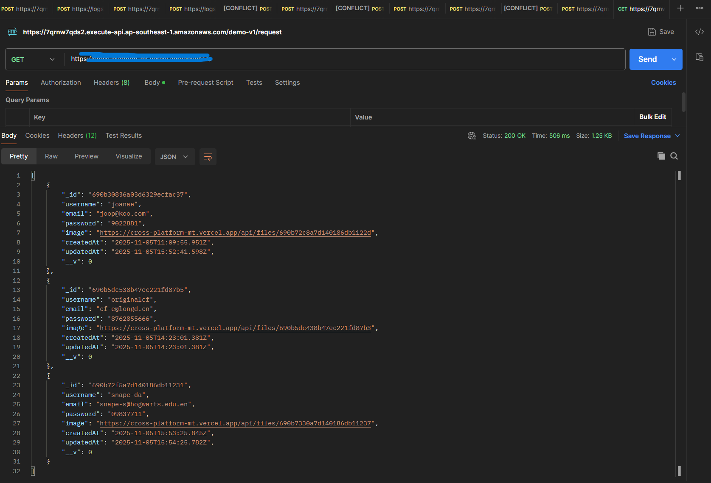
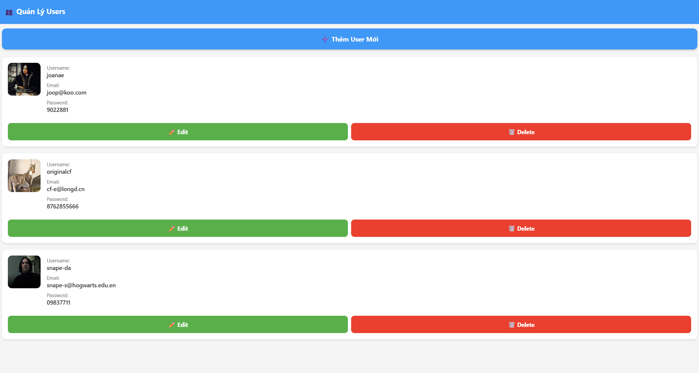
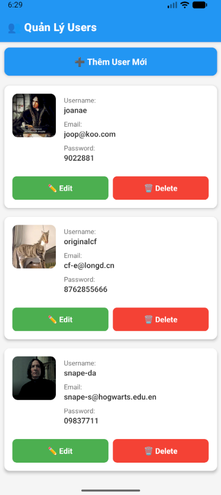

# Báo cáo chi tiết — Các bước thực hiện và các lệnh minh hoạ

## Mục đích

Tài liệu này mô tả chi tiết các bước thiết lập, chạy và kiểm thử dự án (backend + frontend) trong workspace `d:/postgresql/mid-term`. Bao gồm các lệnh minh hoạ phù hợp cho Windows PowerShell và các ví dụ curl.

## Môi trường phát triển (gợi ý)

- Hệ điều hành: Windows (PowerShell)
- Node.js (>= 14 LTS) và npm / yarn
- MongoDB (local hoặc Atlas) — backend dùng GridFS để lưu file (xem `backend/GRIDFS.md`)
- Expo CLI (nếu chạy frontend Expo) hoặc React Native CLI tuỳ cấu hình

## Cấu trúc chính của dự án

- `backend/` — server Node.js (Express). Các file quan trọng:
  - `server.js` — entry server
  - `routes/` — route để upload/download file và user
  - `models/` — model mongoose (User)
  - `.env` — cấu hình kết nối DB (không commit lên Git)
  - `GRIDFS.md` — ghi chú về GridFS

- `frontend/` — app React Native / Expo
  - `App.js`, `src/` chứa screens và API client

## 

- Inputs: source repo; môi trường cục bộ (Node, MongoDB).
- Outputs: server chạy trên port (ví dụ 5000), frontend Expo chạy, có thể upload/download file.
- Error modes: môi trường thiếu biến môi trường, MongoDB không reachable, port trùng.
- Success criteria: có thể gọi API upload file và nhận response 200; frontend kết nối được tới backend.

## Các bước cài đặt & chạy (Windows PowerShell)

Lưu ý: mọi lệnh `cd` là trong PowerShell. Nếu dùng một lần dòng lệnh ghép nhiều lệnh, dùng `;` để phân tách.

### 1) Backend

1. Mở PowerShell, chuyển tới thư mục backend:

```powershell
cd .\backend\
```

2. Cài dependencies:

```powershell
npm install
# hoặc
# yarn install
```

3. Tạo hoặc chỉnh file `.env` (thư mục `backend/.env`). Ví dụ nội dung tối thiểu:

```text
# .env (ví dụ)
PORT=5000
MONGODB_URI=mongodb://localhost:27017/your-db-name
# nếu dùng Atlas: MONGODB_URI=mongodb+srv://<user>:<pass>@cluster0.mongodb.net/dbname
```

4. Chạy server:

```powershell
# nếu package.json có script start
npm start
# hoặc trực tiếp
node server.js
```
5. Kết quả:
```
npm start

> user-admin-backend@1.0.0 start
> node server.js

 Server running on port 5000
 API endpoint: http://localhost:5000/api
 MongoDB connected

```


### 2) Frontend (Expo / React Native)

1. Mở terminal mới, chuyển tới thư mục frontend:

```powershell
cd .\frontend\
```

2. Cài dependencies:

```powershell
npm install
# hoặc
# yarn install
```

3. Khởi động app (Expo):

```powershell
npx expo start
# hoặc nếu package.json có 'start'
npm start
```
4. Kết quả:
```
Starting project at \frontend
Starting Metro Bundler
› Scan the QR code above with Expo Go (Android) or the Camera app (iOS)

› Web is waiting on http://localhost:8081

› Using Expo Go
› Press s │ switch to development build

› Press a │ open Android
› Press w │ open web

› Press j │ open debugger
› Press r │ reload app
› Press m │ toggle menu
› shift+m │ more tools
› Press o │ open project code in your editor

› Press ? │ show all commands

Logs for your project will appear below. Press Ctrl+C to exit.
```
. Mở trên thiết bị/Simulator theo hướng dẫn Expo (scan QR code bằng Expo Go hoặc chạy trên emulator).

### 3) Chạy cả hai (song song)

- Mở 2 terminal/PowerShell: một cho backend (`cd backend; npm start`), một cho frontend (`cd frontend; npm start`).

## Minh hoạ API (ví dụ chung)
Dưới đây là các ví dụ minh hoạ lệnh curl và PowerShell để tương tác với API backend (giả sử backend chạy ở `http://localhost:5000`).

```bash
curl http://localhost:5000/api/users
```


## Giao diện

- Web UI hoặc app React Native sẽ hiển thị danh sách users, form tạo/sửa user với upload ảnh.
  
- Android/iOS: dùng Expo Go chạy app trên simulator, tương tự như web.
  


## Một số chú ý và edge-cases

- Nếu MongoDB không kết nối: kiểm tra `MONGODB_URI` trong `.env` và đảm bảo MongoDB service đang chạy hoặc Atlas cho phép IP kết nối.
- Trùng port: đổi `PORT` trong `.env` hoặc stop process đang chiếm port.
- Upload lớn: nếu dùng GridFS, backend sẽ giữ file lớn an toàn trên MongoDB; kiểm tra cấu hình giới hạn payload trong Express (body-parser / multer).

## Tài liệu tham khảo nội bộ

- Xem `backend/GRIDFS.md` ở root để biết chi tiết cách backend dùng GridFS.
- Kiểm tra `backend/routes/fileRoutes.js` để biết đường dẫn API chính xác và trường form data (tên field upload).
